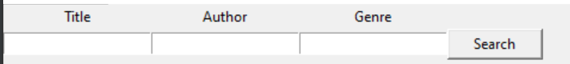
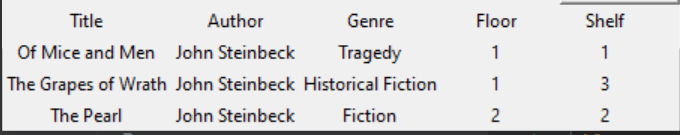
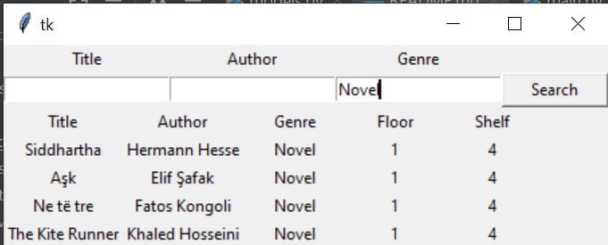

# Library

#

###### Data Directory Structure

    .
    ├── Hivzi Sylejmani - Prishtinë                                  # Library name - Location
    │   ├── 1. Floor                                                 # Floor number
    │   │      ├── 1. Shelf - Tragedy                                # Shelf number - Genre
    │   │      │      └── 1. Of Mice and Men - John Steinbeck.txt    # Book name - Book author   
    │   │      ├── 2. Shelf - Mystery
    │   │      │      ├── 2. Da Vinci Code - Dan Brown.txt
    │   │      │      ...
    │   │      ...    └── n. Book name - Book author
    │   │      └── n. Shelf - Genre             
    │   ├── 2. Floor    
    │   ...
    │   └── n. Floor                
    └── ...

#### Source code directory structure

    .
    ├── src                                  
    │   ├── gui.py          # Code which builds gui
    │   ├── main.py         # Code which is called to start the project    
    │   └── models.py       # Code which keeps project classes
    └── ...

#### Tasks

1. Create `Book` class.
    - Attributes: 
        - `source_path: str`: path to the book file.
        - `number: int`: book number
        - `title: str`: book title
        - `author: str`: book author
        - `genre: str`: book genre
    - Methods:
        - `__str__`:
            - Returns `Nr. Book title - Book author`
            - Example: `6. Siddhartha - Hermann Hesse`

2. Create `Shelf` class.
     - Attributes: 
        - `source_path: str`: path to the shelf directory.
        - `number: int`: shelf number
        - `genre: str`: shelf books' genre
        - `books: list[Book]`: all shelf's books
        - `genre: str`: book genre
    - Methods:
        - `__str__`:
            - Returns `Nr. shelf books' genre`
            - Example: `2. Biography`
        - `get_books`
            - Gets all book files inside `source_path`, creates a `Book` for each file and populates `books` attribute
                with all books.
                
3. Create `Floor` class.
     - Attributes: 
        - `source_path: str`: path to the floor directory.
        - `number: int`: floor number
        - `shelves: list[Shelf]`: all floor's shelves
        - `genre: str`: book genre
    - Methods:
        - `__str__`:
            - Returns `Number of floor`
            - Example: `2`
        - `get_shelves`
            - Gets all shelves's directories inside `source_path`, creates a `Shelf` for each shelf directory
             and populates `shelves` attribute with all shelves.

4. Create `Library` class.
     - Attributes: 
        - `source_path: str`: path to the library directory.
        - `name: str`: library number
        - `location: str`: library location
        - `floors: list[Floor]`: all library floors
    - Methods:
        - `__str__`:
            - Returns `Name of library`
            - Example: `Hivzi Sylejmani`
        - `get_floors`
            - Gets all floors's directories inside `source_path`, creates a `Floor` for each floor directory
             and populates `floors` attribute with all floors.

5. Create `Librarian` class.
     - Attributes: 
        - `name: str`: Name of the librarian.
        - `library: Library`: library the librarian works in
    - Methods:
        - `__str__`:
            - Returns `Name of the librarian`
            - Example: `Cucë`
        - `get_books`
            - args:
                - `title: str (default=None)`: book's title
                - `author: str (default=None)`: book's author
                - `genre: str (default=None)`: book's genre
            - Get's `title`, `author` and `genre` as arguments, and returns a list of books, their floor shelf number.
               Each list item should be a tuple with three items, where first item is a `Book`, second item is
               floor number, third item is shelf number.
        - `show_results`: 
            - `args`:
                - `result`: list of found books (book, floor_number, shelf_number)
                - `frm_results`: frame where results will be shown.
            - Destroys the `frm_results` table body, and repopulates it with new results.
        
        - `search`:
            - args:
                - `title`: book title
                - `author`: book author
                - `genre`: book genre
            - Gets books based on `title`, `author` and `genre` and shows the results
                
6. Write a function that creates `Search frame`:

    
    
    - function name: `create_search_frame`
    - args: `window: tkinter.Tk`
    - return value: ``

7. Write a function that creates `Results Frame`:
    
    
    
    - function name: `create_results_frame`
    - args: `window: tkinter.Tk`
    - return value: `results_frame: tkinter.Frame`    
    
    - Keep in mind that table header is static, table body is dynamic.
    
8. Write a function that creates `Window: tk.Tk`:
    
    
    
    - This function should call `create_search_frame` and `create_results_frame`    
    
9. Write a function that clears results table body:
    
    - function name: `destroy_table_body`
    - args: `results_frame: tkinter.Frame`
    - return value: `None`   
    
9. Write a function that populates results table body:
     
     - function name: `populate_table`
     - args:
        - `result: list`: list of found books (book, floor_number, shelf_number)
        - `frm_results: tkinter.Frame`: frame where results will be shown.   
    